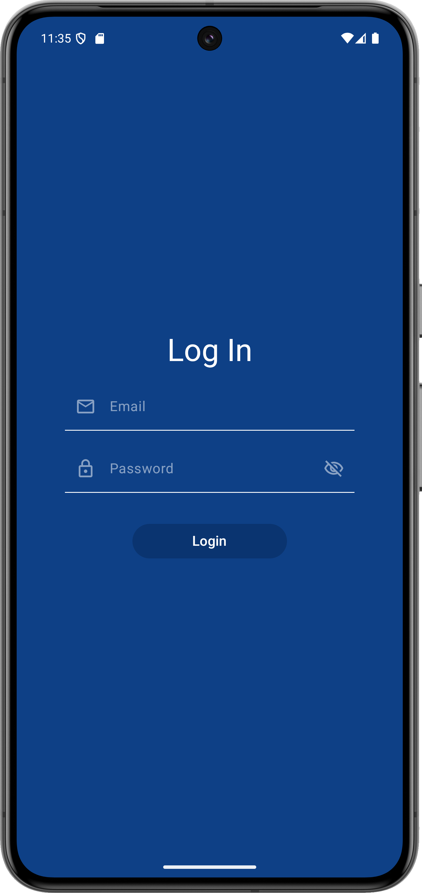
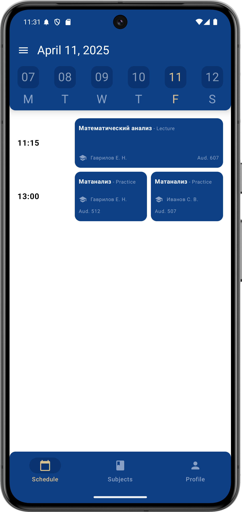
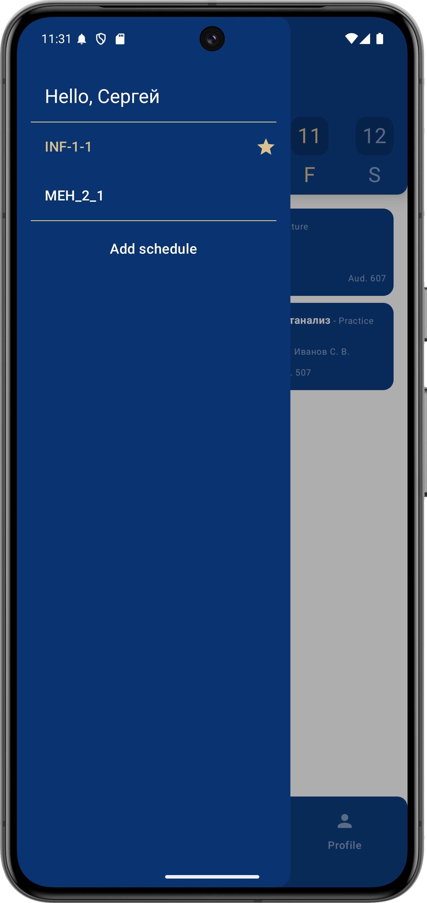
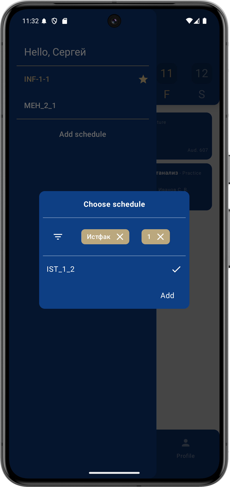
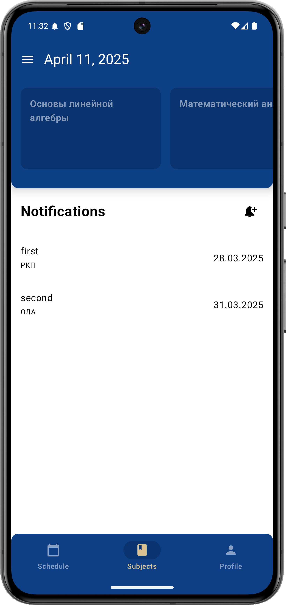
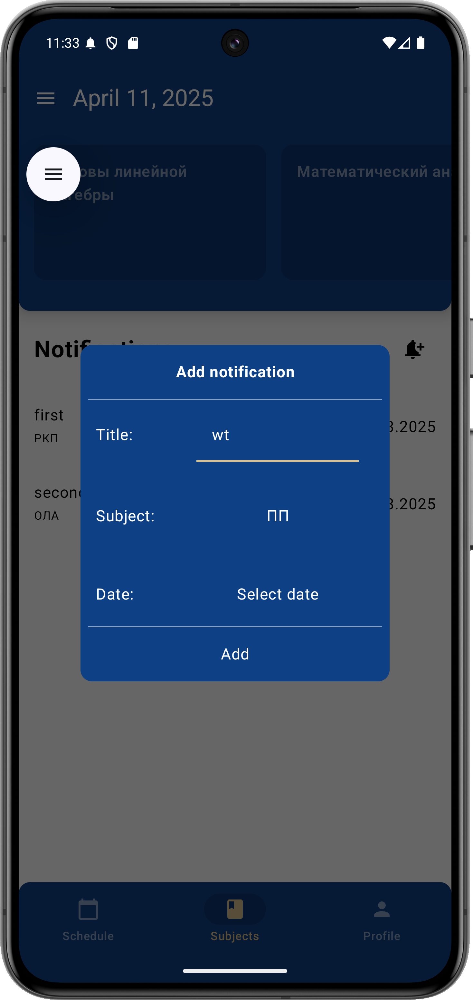
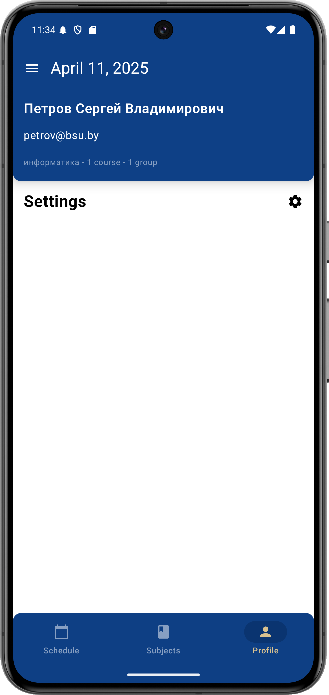

# ScheduleApp
Моя вторая попытка написать приложение учебного расписания. 
## Использованные технологии
- Jetpack Compose
- Retrofit
- Dagger Hilt
- Kotlin Coroutines
- Room database
- [API](https://github.com/rbdmazur/schedule-app-api) для приложения написано на Kotlin Ktor
## Функционал приложения
Приложение имеет аунтефикацию с помощью jwt-tokens. Приложение загружает расписание, которое предусмотрено для пользователя (ученика/студента). Пользователь также может добавить другое расписание. 
Главное расписание пользователя отмечено "звездочкой". Расписание загружается с удаленного сервера и сохраняется в локальную бд, чтобы при следующем заспуске не запаршивать его удаленно. 
## Что планируется добавить
В ближайшее время планирую реализовать экраны "Предметы" и "Профиль". Экран "Предметы" будет содержать список предметов пользователя и список напоминаний, который пользователь может добавлять на определенную дату и предмет или занятие
## Скриншоты приложения
Login screen

Schedule screen(drawer, schedule filter)

Subject screen(with add notification dilog)

Profile screen

